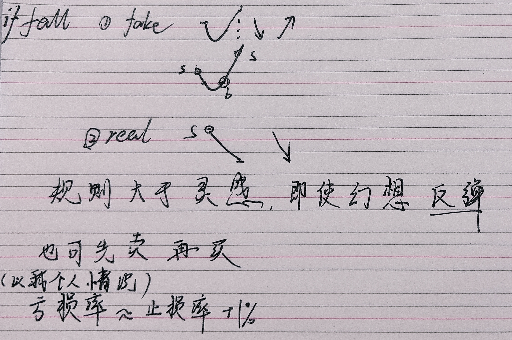
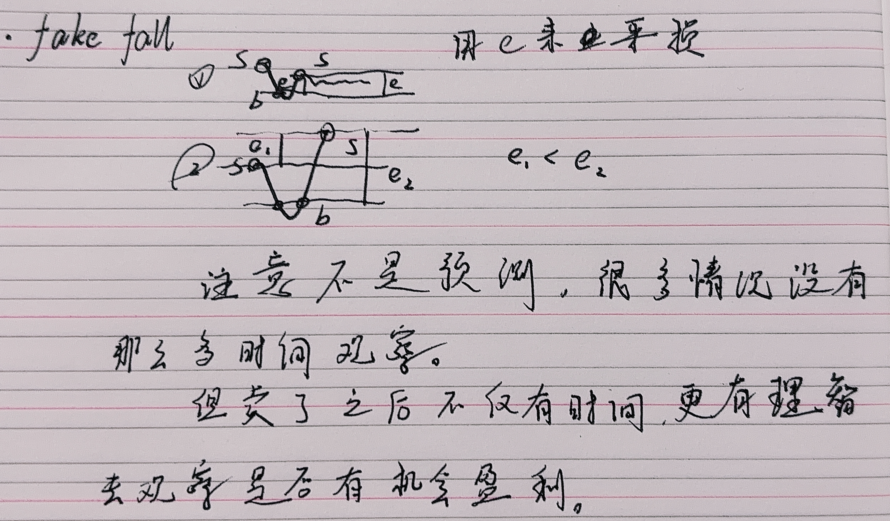

前提：不会买任何 一开始就跌的股。这里不涉及选股，只考虑T+1后的交易。

目标： **“乘势”** 而非 “预测”

态度：卖得坚决，买得谨慎。

止损：-3%，一旦触发 即刻出手

安全：+3%，不亏不赚

止盈：+6%~10%，慎之再慎

- **止损的意义**

### 1️⃣ 防止“亏损雪崩效应”

亏损不是线性累积，而是**复合性的损害**：

| 下跌幅度 | 回本所需涨幅 |
| -------- | ------------ |
| −5%      | +5.3%        |
| −10%     | +11.1%       |
| −20%     | +25%         |
| −30%     | +43%         |
| −50%     | +100%        |

🔸你会发现：
 跌 10% 不算什么，但要涨 11% 才回本。
 跌 30% 就要涨 43% 才能平手。

越拖越难翻身，这就是止损存在的意义。

------

### 2️⃣ 小额资金特别需要止损

因为小额交易中：

- 手续费、印花税等固定成本占比高；
- 资金回旋空间小；
- 被套住一笔，就失去了下次机会。

所以 **小额短线投资者比大资金更该严格止损**。

---------------------------------------------------------------

关于幻想（即 fake fall）：

----

- **止盈**
  - 勿拖，3~4天
  - 勿幻想
  - 达线必交易
  - 先快后慢，主力先跑，余部断后

追高要趁早（第一天最佳,越迟风险越大）

低位进：（难得）

1. 升：（看上限10%）多手慢出，升得越快 出得越慢，（至2，开降）
2. 升降：此时 “主力”已出，余部看底线 以高点为起点进行止损

高位进：（风险大）

- 及格6% 则出主力
- 若升 慢出；若降  低位+6%~高位-3%
- 如若反应不及时 被套牢，低位+3% 平仓
- 不要一手低 再一手高，会拖垮主力跑不及时

